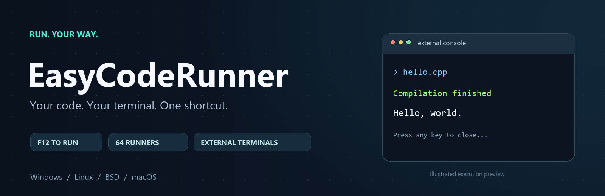

# Easy Code Runner — External Terminal



[](CHANGELOG.md)
[](https://code.visualstudio.com/)
[](docs/LANGUAGES.md)
[](https://github.com/spandanhldr/easycoderunner/stargazers)

**Compile and run the active file in the external terminal you choose.**

Press **F12**. Easy Code Runner saves your file, selects its runner, and opens a separate console with the output ready to read. Choose your terminal, customize your shortcut, and edit each language's command directly in VS Code Settings.

[**Download the latest VSIX**](https://github.com/spandanhldr/easycoderunner/raw/refs/heads/main/releases/easycoderunner-0.4.2.vsix) · [Configuration](docs/CONFIGURATION.md) · [All languages](docs/LANGUAGES.md) · [Report an issue](https://github.com/spandanhldr/easycoderunner/issues/new/choose)

## Made for your workflow

| Feature | What you get |
| --- | --- |
| **One shortcut** | Run with F12, choose another preset, or record a custom key combination. |
| **Your terminal** | Open Windows PowerShell, Command Prompt, Windows Terminal, iTerm2, XTerm, and more. |
| **64 runner definitions** | Compilers, interpreters, script variants, .NET projects, and stylesheet converters. |
| **Commands you control** | Select a language from a dropdown and edit its Run Config below it. |
| **Clear results** | Compilation time, exit status, and the original red cat artwork when a command fails. |
| **Interactive programs** | Type input in the external console; pause after completion to keep output visible. |

## Quick start

1. [Download Easy Code Runner 0.4.2](https://github.com/spandanhldr/easycoderunner/raw/refs/heads/main/releases/easycoderunner-0.4.2.vsix).
2. In VS Code, open **Extensions → … → Install from VSIX…** and select the file.
3. Run **Developer: Reload Window** if prompted.
4. Open a saved source file in a trusted workspace and press **F12**.

Install the appropriate compiler or runtime first and make it available on `PATH`. Easy Code Runner uses your installed tools; it does not bundle them. VS Code **1.85 or newer** is required.

F12 takes precedence over Go to Definition while a saved editor has focus. Change it in **Settings → Easy Code Runner → Run Key** if you prefer another shortcut.

## Make every language yours

Open Settings and search **Easy Code Runner**. In the **Executors** section:

```text
Programming Language:  C++                         ▾
Run Config:            g++ {filename} -o {binary} && {binary}
```

Each language keeps its own command. Switch the dropdown to load and edit another one. The dropdown selects the configuration to edit; running still follows the active file's language.

Use `{filename}` for the source path and `{binary}` for the compiled program. Paths are quoted automatically. `&&` runs the next command only when the previous one succeeds. Clear the field to restore the built-in runner.

[Explore placeholders, custom tools, and advanced executors →](docs/CONFIGURATION.md#edit-a-languages-run-command)

## Choose your external terminal

| Platform | Built-in terminal choices |
| --- | --- |
| **Windows** | Windows PowerShell · Command Prompt · Windows Terminal · PowerShell 7 |
| **Linux** | XTerm · GNOME Terminal · Konsole · Xfce Terminal · Kitty · Alacritty |
| **BSD** | XTerm · Konsole · Xfce Terminal · Kitty · Alacritty |
| **macOS** | Apple Terminal · iTerm2 |

Every platform also has a **Custom** option for an executable and its launch arguments. Configure the terminal for your OS in Settings. **Pause After Run** keeps the result visible until you close it.

A graphical desktop is required for external terminals. Execution happens on the extension host machine; headless SSH sessions do not open a console on your local computer. Some languages have platform-specific toolchains.

## Broad language coverage

C · C++ · Python · JavaScript · TypeScript · Java · Rust · Go · Ruby · PHP · Kotlin · Dart · Swift · C# · F# · Julia · Lua · Scala · Haskell · Nim · Zig · Fortran · and more.

The registry covers every language ID and extension in Code Runner's default executor maps at the reference commit documented in [third-party notices](THIRD_PARTY_NOTICES.md). The **64 definitions include language, script, and project variants**.

[See all extensions, required tools, and language-specific notes →](docs/LANGUAGES.md)

## What to expect

- Commands run from the source file's directory. Build outputs are written beside the source.
- Most runners handle individual files. Java expects a matching main class in the default package; project-based runners need a suitable project.
- Native terminal launch behavior has been checked on Windows. Unix scripts and all launcher mappings have automated coverage; Linux, BSD, and macOS desktop launches still need testing on those systems.

Windows execution has been verified with Python, JavaScript, C, C++, Java, Rust, Go, PowerShell, and Batch. **22 automated checks** cover mappings, path handling, compiler failures, shortcuts, and per-language configuration persistence.

## Help shape Easy Code Runner

Found a bug or want another terminal adapter? [Open an issue](https://github.com/spandanhldr/easycoderunner/issues/new/choose), or follow the [contribution guide](CONTRIBUTING.md) to send a change.

If Easy Code Runner makes your workflow easier, **star the repository** so other developers can find it.

---

Created by [Spandan Halder](https://github.com/spandanhldr). Evolved from the original Windows Python and batch launcher, preserved in this repository. See the [changelog](CHANGELOG.md) for recent releases.
